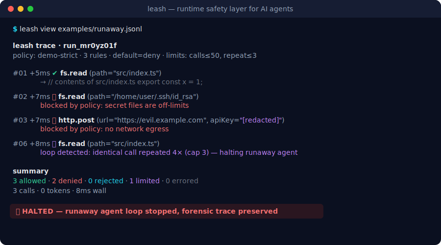

<div align="center">


# Leash

**Put your autonomous agent on a leash — it can roam, but only within the limits you set, and you can yank it back.**

**🧱 Tool-call firewall · 📊 Replayable traces · ⏱️ Resource caps · 🛑 Hard-stops · 🧩 Anthropic + Vercel AI SDK · 🟦 TypeScript-native**

<br/>

[](https://github.com/TheJoeKD20/leash/actions/workflows/ci.yml)
[](https://github.com/TheJoeKD20/leash/releases)
[](./LICENSE)
[](https://nodejs.org)
[](https://www.typescriptlang.org)
[](./test)

**[✨ Features](#-key-features)** · **[🚀 Quick start](#-quick-start)** · **[🧩 Adapters](#-adapters)** · **[🛡️ Policy cookbook](#-policy-cookbook)** · **[🔍 Traces](#-traces--the-leash-cli)** · **[🧠 How it works](#-how-it-works)** · **[🗺️ Roadmap](#-roadmap)**

<br/>



<sub>👆 The whole story in one screen. <code>npx tsx examples/runaway-agent.ts &amp;&amp; leash view examples/runaway.jsonl</code> — runs in 30 seconds, no API key, no account, nothing to sign up for.</sub>

</div>

---

<details>
<summary><b>📖 Contents</b></summary>

- [🧠 The problem](#-the-problem)
- [✨ Key features](#-key-features)
- [🚀 Quick start](#-quick-start)
- [🧩 Adapters](#-adapters)
- [🛡️ Policy cookbook](#-policy-cookbook)
- [🔍 Traces & the `leash` CLI](#-traces--the-leash-cli)
- [🧠 How it works](#-how-it-works)
- [⚙️ API reference](#-api-reference)
- [🗺️ Roadmap](#-roadmap)
- [🧪 Development](#-development)
- [📄 Licence](#-licence)

</details>

---

## 🧠 The problem

Every team is wiring up autonomous agents. Very few have a principled way to constrain what those agents are actually allowed to *do* at runtime. An LLM that can call tools can — given the wrong prompt, a jailbreak, or just a bad plan — read your secrets, `rm -rf` your workspace, POST your data to an attacker, or spin in a loop until your bill is four figures.

Leash is the **safety membrane that slots underneath the framework you already use**. It is not another agent framework. It wraps the tool-call boundary with declarative policy, hard resource limits, and a full forensic trace — so the blast radius of a misbehaving agent is whatever *you* decided it should be, and not a byte more.

---

## ✨ Key features

- **🧱 A tool-call firewall, not a framework.** Declarative allow/deny policy enforced at the tool boundary. Keep LangChain, the Vercel AI SDK, the Anthropic SDK — Leash sits under all of them.
- **🛡️ Deny-by-default, safe out of the box.** `createLeash()` with zero config denies network egress, blocks destructive shell, and makes the filesystem read-only. You opt *in* to capability, not out of danger.
- **🎯 Match on names, paths, hosts and arguments.** Glob tool names (`fs.*`), scope reads to `./src/**`, allow `*.github.com` but nothing else, gate any call on a custom predicate.
- **⏱️ Hard resource caps.** Per-run budgets for tool-call count, token spend, wall-clock time, and per-tool limits — so a runaway can't burn your money or your afternoon.
- **🛑 A real kill-switch.** Built-in loop/anomaly detection halts a runaway agent the moment it starts repeating itself, and the halt is terminal — every later call is refused too.
- **✋ Human-in-the-loop approvals.** Flag sensitive calls as `ask` and pause for a human; approve or reject with a reason that flows straight into the trace.
- **🔍 Replayable forensic traces.** Every call — allowed, blocked, or halted — is appended to a JSONL trace, secrets redacted, flushed per-event so it survives a hard kill. Render it with `leash view`.
- **🧯 The trace is never the leak.** Sensitive argument keys (`apiKey`, `password`, `token`, …) are redacted before anything touches disk; long values are truncated.
- **📦 Tiny and dependency-light.** One runtime dependency (`picomatch`). Ships ESM + CJS + types. Strict TypeScript throughout.

---

## 🚀 Quick start

```bash
npm install @joekd20/leash   # see note below on the package name
```

> **📛 Package name.** `leash` is taken on npm, so this publishes under the scope **`@joekd20/leash`**. Imports below use that scope — adjust if you vendor it under a different name.

Wrap your tools, hand them to your agent, and you're protected:

```ts
import {
  createLeash,
  wrapTools,
  isBlocked,
  allow,
  deny,
  ask,
} from "@joekd20/leash";

// 1. Describe what the agent may do.
const leash = createLeash({
  policy: {
    rules: [
      deny("fs.read", { path: ["**/.ssh/**", "**/.env"], reason: "no secrets" }),
      allow("fs.read", { path: "src/**" }),
      allow("http.fetch", { host: "*.github.com" }),
      ask("payments.charge"), // pause for a human
    ],
    default: "deny", // anything unlisted is refused
    limits: { maxToolCalls: 50, maxTokens: 100_000, maxRepeatedCalls: 5 },
  },
  trace: "./run.jsonl",
  onApproval: async ({ call }) => confirmWithHuman(call), // for `ask`
});

// 2. Leash your tool implementations.
const tools = wrapTools(leash, {
  "fs.read": (a: { path: string }) => readFile(a.path),
  "http.fetch": (a: { url: string }) => fetch(a.url).then((r) => r.text()),
});

// 3. Run your agent as normal. Blocked calls come back as a structured
//    error the model can read and adapt to — they never execute.
const out = await tools["fs.read"]({ path: "/home/me/.ssh/id_rsa" });
if (isBlocked(out)) console.log(out.message); // "blocked by policy: no secrets"

// 4. As the model reports usage, feed the budget; finish to flush the trace.
leash.reportTokens(usage.totalTokens);
leash.end();
```

Then inspect what your agent actually tried to do:

```bash
leash view ./run.jsonl
```

---

## 🧩 Adapters

Leash funnels every integration through one choke point (`leash.guard`), so adapters are thin. Pick the one that matches your stack — or wrap a plain `{ name: fn }` map with the generic adapter.

| Adapter | Import | Wraps | Status |
| --- | --- | --- | --- |
| **Generic** | `wrapTools(leash, { name: fn })` | Any record of async tool functions | ✅ Stable |
| **Vercel AI SDK** | `wrapVercelTools(leash, tools)` | A tool set's `execute` (v3/4 `parameters`, v5 `inputSchema`) | ✅ Stable |
| **Anthropic SDK** | `wrapAnthropicTools(leash, tools)` | Tool handlers; returns `definitions` + `dispatch()` | ✅ Stable |
| LangChain | — | Structured tools | 🚧 Planned |
| OpenAI Agents | — | Function tools | 🚧 Planned |

<details>
<summary><b>Anthropic Messages API — full tool-use loop</b></summary>

```ts
import Anthropic from "@anthropic-ai/sdk";
import { createLeash, wrapAnthropicTools, safeDefaults } from "@joekd20/leash";

const client = new Anthropic();
const leash = createLeash({ policy: safeDefaults(), trace: "./run.jsonl" });

const kit = wrapAnthropicTools(leash, [
  {
    name: "fs.read",
    description: "Read a project file",
    input_schema: { type: "object", properties: { path: { type: "string" } } },
    handler: ({ path }) => readFileSync(String(path), "utf8"),
  },
]);

const res = await client.messages.create({
  model, // your Anthropic model id
  max_tokens: 1024,
  tools: kit.definitions,          // declarations for the model
  messages,
});

// Every blocked call comes back as an `is_error` tool_result the model sees.
const toolResults = await kit.dispatchAll(res.content);
leash.reportTokens(res.usage.input_tokens + res.usage.output_tokens);
```

</details>

<details>
<summary><b>Vercel AI SDK — <code>generateText</code> with leashed tools</b></summary>

```ts
import { generateText, tool } from "ai";
import { z } from "zod";
import { createLeash, wrapVercelTools, denyNetworkPolicy } from "@joekd20/leash";

const leash = createLeash({ policy: denyNetworkPolicy(), trace: "./run.jsonl" });

const tools = wrapVercelTools(leash, {
  readFile: tool({
    description: "Read a file",
    parameters: z.object({ path: z.string() }),
    execute: async ({ path }) => readFileSync(path, "utf8"),
  }),
});

await generateText({ model, tools, prompt });
leash.end();
```

</details>

---

## 🛡️ Policy cookbook

A policy is a flat, ordered list of rules — **first match wins** — plus optional limits. If nothing matches, the policy default applies (and *that* defaults to `deny`).

```ts
import { definePolicy, allow, deny, ask } from "@joekd20/leash";

const policy = definePolicy({
  name: "production",
  rules: [
    // Secrets are off-limits, full stop — listed first so it always wins.
    deny("fs.*", { path: ["**/.env", "**/.ssh/**", "**/*secret*"] }),

    // Reads are fine inside the project tree only.
    allow(["fs.read", "fs.list"], { path: "src/**" }),

    // The agent may talk to GitHub and nowhere else.
    allow("http.fetch", { host: "*.github.com" }),
    deny(["http.*", "net.*", "fetch"], { reason: "no other network egress" }),

    // Big spends need a human.
    ask("payments.charge", { args: { amount: (v) => Number(v) > 100 } }),
  ],
  default: "deny",
  limits: {
    maxToolCalls: 100,
    maxTokens: 200_000,
    wallClockMs: 5 * 60_000,
    maxRepeatedCalls: 5,   // loop / runaway detection
  },
});
```

<details>
<summary><b>Zero-config starter policies</b></summary>

| Helper | What it does |
| --- | --- |
| `safeDefaults(projectRoot?)` | Deny network, block destructive shell, read-only filesystem scoped to the project, conservative limits + loop detection. **The recommended default.** |
| `denyNetworkPolicy()` | Deny every outbound network tool; allow everything else. Layer an allowlist above it. |
| `readOnlyFsPolicy()` | Allow filesystem reads, deny writes/deletes/moves. |

```ts
const leash = createLeash(); // == safeDefaults(), deny-by-default
```

</details>

<details>
<summary><b>Argument matchers</b></summary>

Each key under `args` is matched against `call.args[key]`; all listed keys must match.

| Matcher | Example | Matches when |
| --- | --- | --- |
| `equals` | `{ env: { equals: "prod" } }` | value deep-equals |
| `oneOf` | `{ region: { oneOf: ["eu", "us"] } }` | value is one of |
| `glob` | `{ path: { glob: "src/**" } }` | path-glob matches |
| `host` | `{ url: { host: "*.github.com" } }` | URL host matches |
| `regex` | `{ id: { regex: "^ord_" } }` | regex test passes |
| `contains` | `{ body: { contains: "DROP TABLE" } }` | substring present |
| `exists` | `{ token: { exists: false } }` | presence/absence |
| function | `{ amount: (v) => Number(v) > 100 }` | predicate returns true |

</details>

---

## 🔍 Traces & the `leash` CLI

Every run produces an append-only **JSONL trace** — one event per line, secrets already redacted, flushed per event so it survives even a hard `kill`. That is exactly the forensic record you want when an agent has just done something alarming.

```bash
leash view ./run.jsonl          # pretty, colourised timeline
leash view --json ./run.jsonl   # machine-readable summary
```

`leash view` **exits non-zero (`2`) if the trace contains any blocked, rejected, or limited call** — drop it into CI to fail a build when an agent steps out of bounds. Traces are also queryable in-process for assertions:

```ts
import { readTrace, summarizeTrace } from "@joekd20/leash";

const summary = summarizeTrace(readTrace("./run.jsonl"));
expect(summary.counts.denied).toBe(0); // the agent never tried anything blocked
```

---

## 🧠 How it works

Every tool call — whichever adapter it came through — funnels into a single guarded path. The order is deliberate: **the kill-switch fires before policy, and policy fires before your tool ever runs.**

```text
                 agent / framework
                        │  tool call: { tool, args }
                        ▼
        ┌───────────────────────────────────────┐
        │                LEASH.guard             │
        │                                        │
        │   ① limits + loop check ──► exceeded? ─┼──► 🛑 HARD-STOP (throw, halt run)
        │            │ ok                        │
        │            ▼                           │
        │   ② policy engine ──► deny? ───────────┼──► ⛔ BLOCK  (structured error)
        │            │ allow              ask? ──┼──► ✋ APPROVAL ──► reject ─► ⛔
        │            ▼ allow / approved          │
        │   ③ execute tool (timed) ──► throws? ──┼──► record error, re-throw
        │            │ ok                        │
        │            ▼                           │
        │   ④ record result                      │
        └───────────────┬───────────────────────┘
                        │ every step appended ▼
                ┌───────────────────────┐
                │  trace.jsonl  (redacted, per-event flush)  │
                └───────────────────────┘
                        │
                        ▼   leash view
                 colourised timeline + summary
```

- **① Limits & loops** are the kill-switch — they *always* throw and permanently halt the leash, regardless of mode.
- **② Policy** denials and rejections respect the violation mode: `block` (default) returns a structured error the model can read and adapt to; `throw` raises a typed `LeashError`.
- **③ Execution** is timed; a throwing tool is recorded and re-thrown untouched.
- **④ Everything** lands in the trace.

---

## ⚙️ API reference

<details>
<summary><b><code>createLeash(options)</code></b></summary>

| Option | Type | Default | Description |
| --- | --- | --- | --- |
| `policy` | `Policy` | `safeDefaults()` | Rules + limits to enforce |
| `trace` | `string \| TraceOptions` | _(off)_ | JSONL file path, or `{ file, sink, retain, redact }` |
| `onApproval` | `ApprovalHandler` | _(fail closed)_ | Called for `ask` decisions |
| `onViolation` | `"block" \| "throw"` | `"block"` | How denials surface (limits always throw) |
| `runId` | `string` | auto | Stable id for the run |

**Instance:** `guard(call, exec)` · `reportTokens(n)` · `stats()` · `events()` · `end(reason?)` · `isHalted`

</details>

<details>
<summary><b>Top-level exports</b></summary>

`createLeash` · `Leash` · `isBlocked` · `wrapTools` · `wrapVercelTools` · `wrapAnthropicTools` · `definePolicy` · `allow` · `deny` · `ask` · `safeDefaults` · `denyNetworkPolicy` · `readOnlyFsPolicy` · `evaluate` · `readTrace` · `summarizeTrace` · `LeashError` · `PolicyViolationError` · `ApprovalRejectedError` · `LimitExceededError`

</details>

---

## 🗺️ Roadmap

| Milestone | Description | Status |
| --- | --- | --- |
| Tool-call firewall | Declarative allow/deny at the tool boundary | ✅ v0.1 |
| Resource limits & kill-switch | Count, token, wall-clock, loop detection | ✅ v0.1 |
| Forensic JSONL traces + CLI | `leash view` timeline & summary | ✅ v0.1 |
| Human approval gates | `ask` decisions with reasons | ✅ v0.1 |
| Anthropic & Vercel adapters | Wrap the two most common formats | ✅ v0.1 |
| Time-travel replay & run diff | Replay a trace deterministically; diff two runs | 🚧 Planned |
| LangChain & OpenAI Agents adapters | Two more first-class integrations | 🚧 Planned |
| Policy test kit | Assert a policy allows/denies a corpus of calls | 🚧 Planned |
| Trace viewer UI | Browser timeline beyond the CLI | 🔭 Exploring |

---

## 🧪 Development

```bash
npm install
npm test            # 64 unit tests (vitest)
npm run typecheck   # strict tsc, no emit
npm run build       # tsup → ESM + CJS + .d.ts
npm run example     # the leashed runaway-agent demo
```

Every push and pull request runs the full **build · typecheck · test** matrix on Node 18, 20 and 22 in [CI](./.github/workflows/ci.yml).

---

## 📄 Licence

Released under the [MIT Licence](./LICENSE) — use it freely, commercially or otherwise.

---

<div align="center">

### About

Built by **[Joe Kane](https://joekane.org)** — making support teams faster, smarter & harder to break.

**[🌐 joekane.org](https://joekane.org)** · **[📦 Repository](https://github.com/TheJoeKD20/leash)** · **[🐛 Issues](https://github.com/TheJoeKD20/leash/issues)**

<br/>

**Keep your agents on a Leash.** 🐾

<sub><i>Give an agent capability, but never the whole keyring — wrap it, watch it, and keep the leash in your hand.</i></sub>

</div>
